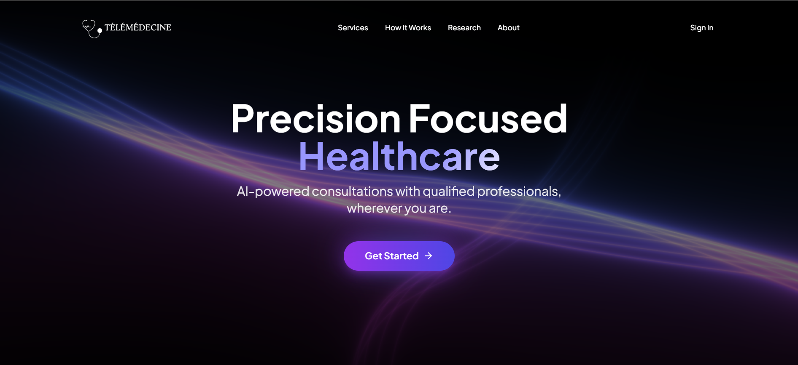
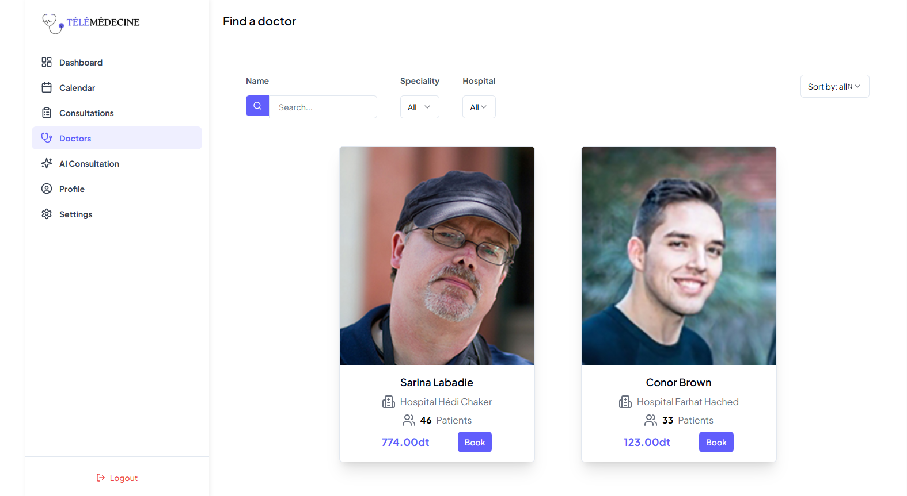
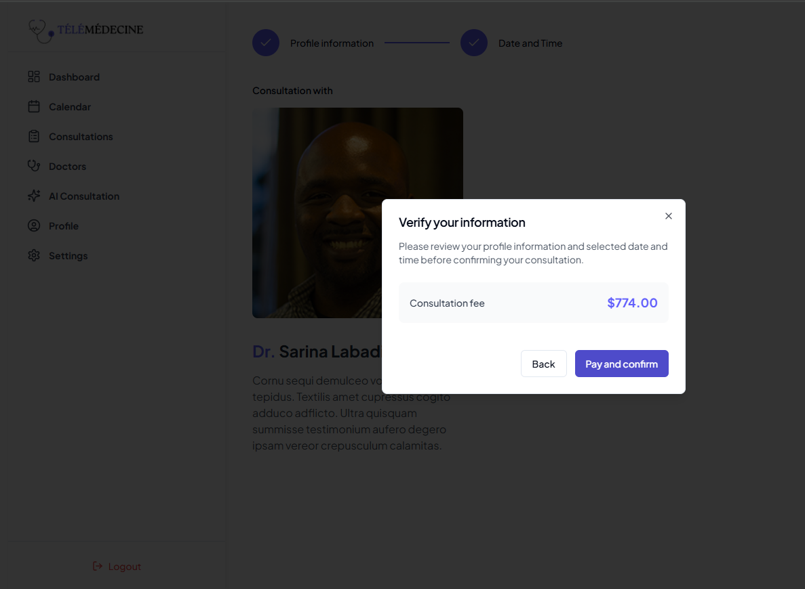
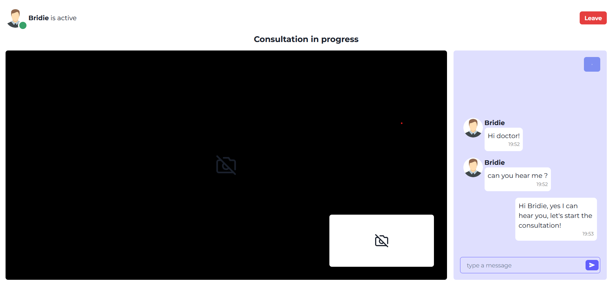
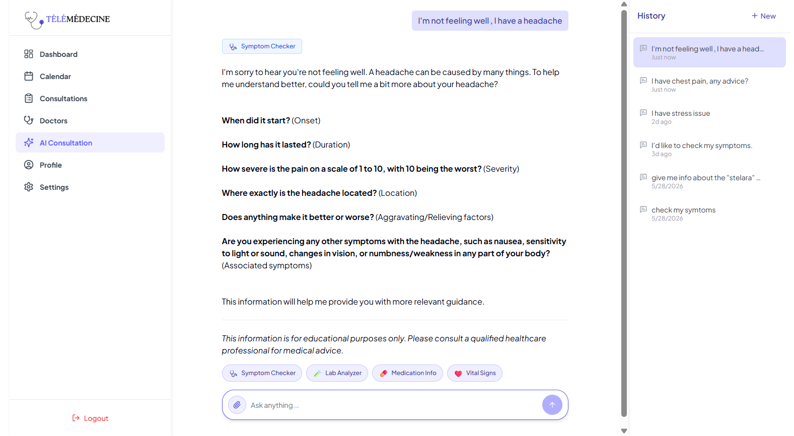
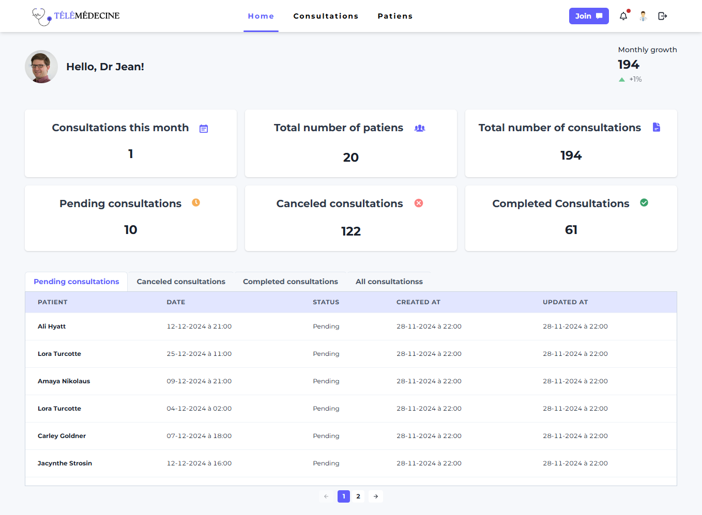

# Télémédecine

An open-source telemedicine boilerplate: a working telehealth app you can rebrand and build your product on.

It's built with Next.js, Express, MongoDB, Clerk, LiveKit, Stripe and Gemini.

**[Live demo](https://bucolic-malabi-07ed64.netlify.app)**: the sign-in page lists a demo patient and a demo doctor account, so you can try both sides without signing up.



## Table of Contents

- [What's included](#whats-included)
- [Features](#features)
- [Screenshots](#screenshots)
- [Tech stack](#tech-stack)
- [Getting started](#getting-started)
- [Documentation](#documentation)
- [Roadmap](#roadmap)
- [Contributing](#contributing)
- [License](#license)

## Features

**Patients**

- Search approved doctors by name, specialty or hospital.
- Book a time slot and pay through Stripe Checkout. Doctors without a price are booked for free.
- Join the consultation when its hour starts, with video, audio and chat.
- Ask the AI assistant about symptoms, lab results, medications and vital signs. It can read uploaded PDFs and images, and answers questions about the patient's own profile and past consultations. See [AI assistant](docs/ai-assistant.md).
- Follow consultations in a dashboard, a calendar and a history list.

**Doctors**

- Sign up, complete a profile (specialty, hospital, price, weekly schedule, photo) and wait for an admin's approval.
- See upcoming consultations and past patients.
- Get in-app notifications for new bookings and for a consultation that is starting.

**Admins**

- Approve, reject and edit doctors, and manage patient records.

**Platform**

- Sign-in and sign-up with Clerk, with separate patient and doctor sign-up pages.
- Consultations start and close automatically on the hour.
- A scroll-driven 3D landing page.
- Responsive layout for phones, tablets and desktops.
- Optional [demo mode](docs/demo-mode.md) with ready-made doctor and patient logins.

## Screenshots

### Find a doctor



### Book and pay



### Video consultation



### AI assistant



### Doctor dashboard



## Tech stack

- **Frontend:** Next.js (App Router), Tailwind CSS, shadcn/ui, TanStack Query, Redux Toolkit, React Three Fiber and GSAP for the landing page
- **Backend:** Node.js, Express, MongoDB with Mongoose, node-cron
- **Authentication:** Clerk
- **Video and chat:** LiveKit
- **Payments:** Stripe Checkout
- **AI:** Gemini through the Vercel AI SDK (chat) and LangChain (embeddings), with MongoDB Atlas Vector Search
- **Hosting:** Netlify (frontend) and Render (backend)

## Getting started

You need Node.js 20 or later, [pnpm](https://pnpm.io/) 8, and free accounts with MongoDB Atlas, Clerk, Cloudinary, LiveKit, Google AI Studio and Stripe.

1. Clone the repository and install dependencies:

   ```bash
   git clone https://github.com/aminezouari52/telemedicine-website.git
   cd telemedicine-website
   pnpm install
   ```

2. Create `apps/backend/.env` and `apps/frontend/.env` from the `.env.example` file in each folder, and fill in your keys. [Configuration](docs/configuration.md) explains each service.

3. Start both apps:

   ```bash
   pnpm dev
   ```

   The frontend runs on http://localhost:3000 and the backend on http://localhost:8000.

4. Optionally, fill the database with sample doctors, patients and consultations:

   ```bash
   pnpm -F=backend seed:all
   ```

   This deletes existing doctors, patients and consultations first. See [Sample data](docs/seeding.md).

## Documentation

| Guide                                  | What it covers                                                           |
| -------------------------------------- | ------------------------------------------------------------------------ |
| [Configuration](docs/configuration.md) | The services you need, environment variables, and values that must match |
| [Sample data](docs/seeding.md)         | The seed scripts, what they delete, and the order they run in            |
| [Payments](docs/payments.md)           | Stripe setup, the payment flow, and testing payments locally             |
| [AI assistant](docs/ai-assistant.md)   | What the assistant can do, its setup, and prompts to try                 |
| [Demo mode](docs/demo-mode.md)         | Public demo logins: turning them on and removing them                    |
| [Branding](docs/branding.md)           | Changing the name, logo, colours and fonts                               |
| [AGENTS.md](AGENTS.md)                 | Architecture notes and commands, for contributors and AI coding agents   |

## Contributing

This project is open-source, and I’m excited to collaborate with developers around the world.

Pull requests are welcome. For major changes, please open an issue first
to discuss what you would like to change.

## License

[MIT](https://choosealicense.com/licenses/mit/)
